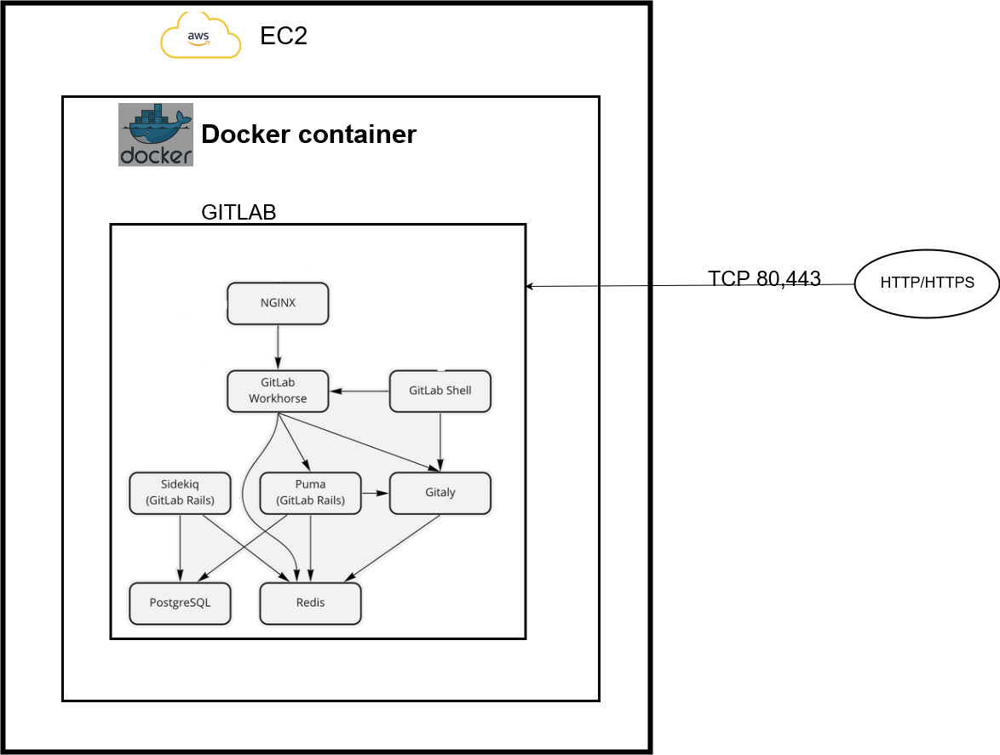

# Deploying GitLab service

__Contents:__

* [Introduction](#intro)
* [Components Used](#components)
* [Files description in project](#files)
* [Steps done to deploy GitLab service](#steps)
* [Outputs](#output)

## Introduction

**GitLab** is an application for software development, security, and operations that enables Concurrent DevOps. GitLab makes the software
lifecycle faster and radically improves the speed of business. It provides solutions for each of the stages of the DevOps lifecycle.

More on GitLab: https://docs.gitlab.com/ee/

## Components Used

Following components were used to design this project:

1. **EC2** -- AWS cloud instance to create one Linux server.

2. **Docker** -- Installed docker on EC2 to contanerize services(GitLab) to be deployed.

3. **GitLab** -- Deployed GitLab service as a docker container.

## Files description in project

* [docker-compose.yml](./deploy/docker-compose.yml) -- used to deploy GitLab image as container in EC2 with docker installed on it.

## Steps done to deploy GitLab service:

1) Create EC2 linux instance on AWS using linux AMIs.
2) Login into remote AWS server using the ssh command( make sure ssh rule is defined in security groups to ssh to this server):
3) Install docker on server.
4) Install GitLab using Docker Compose file.
5) Access GitLab on EC2_Ip_Address.

## Outputs
Outputs captured here [output.docx](./output.docx)
